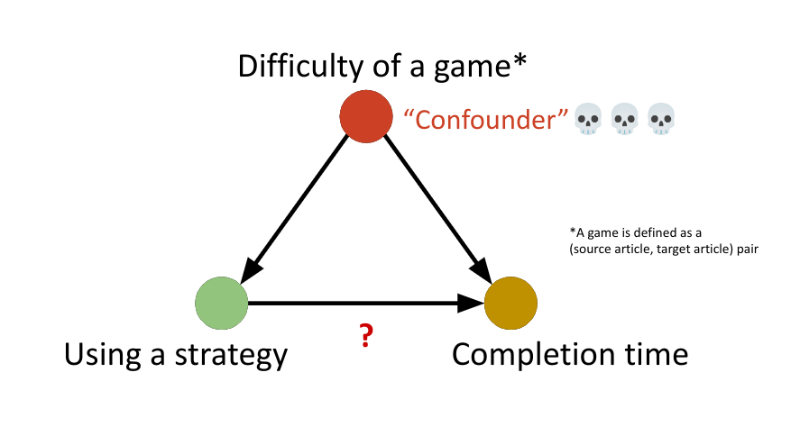
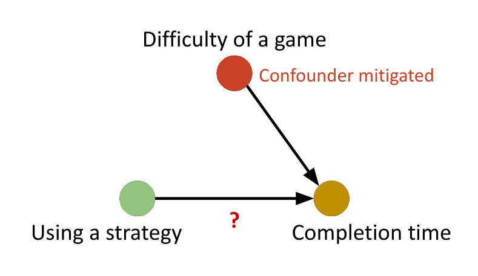

**Abstract**
In the Wikispeedia game players are tasked to rapidly navigate from one article to another in a simplified Wikipedia network using hyperlinks. Using over 75,000 gameplay paths, we aim to uncover strategies players employ, such as using hub articles and hierarchical thinking. We also investigate how link positioning influences player choices. Combining network analysis with behavioral data, we seek to understand what makes paths challenging and how players’ knowledge organization affects navigation strategies. Finally, we contrast human strategies with optimal paths in the network, and craft some advice for the players.
{: #abstract }

## Introduction

This research is based on a dataset collected in the context of [Wikispeedia](https://dlab.epfl.ch/wikispeedia/play/){:target="_blank"}, a game where players are tasked to reach one article from another only using hyperlinks on a subset of Wikipedia. A quick analysis shows that humans are not optimal, as they usually take paths longers than the shortest paths, as they visit on average **x2.4** more articles than needed.

  <iframe src="assets/plots/game_stats_intro.html" width="100%" height="550px" frameborder="0"></iframe>

This leads us to study the specificities of human navigation patterns in Wikipedia, and understand what the most efficient strategies are for browsing the Wikipedia network.

  
Wikispeedia Website

  

    
4.5k+ articles

    
124k+ hyperlinks

  

Quite naturally the network of articles reveals dominant subjects or articles in Wikispeedia.

  <iframe src="assets/plots/communities_graph.html" width="100%" height="550px" frameborder="0"></iframe>
  

    
Main hubs

    <table style="display:table;table-layout:fixed;width: 100%;">
      <thead>
          <tr>
              <th>Article</th>
              <th>Pagerank Score</th>
          </tr>
      </thead>
      <tbody>
          <tr><td>United States</td><td>0.032</td></tr>
          <tr><td>Europe</td><td>0.014</td></tr>
          <tr><td>United Kingdom</td><td>0.014</td></tr>
          <tr><td>England</td><td>0.0112</td></tr>
          <tr><td>Africa</td><td>0.009</td></tr>
          <tr><td>Earth</td><td>0.008</td></tr>
          <tr><td>World War II</td><td>0.008</td></tr>
      </tbody>
  </table>
  

The next community is **Computer Science 🤖** with only 124 articles.

### Game Data
The Wikispeedia dataset contains games of Wikispeedia. In this game, a player is given a pair of two articles present on the website, and his goal is to go from the first to the second article by taking hyperlinks on Wikispeedia. The dataset contains paths taken by the players for different games and players and their overall time.

**Example** Joining *Yarralumla* to *Abraham Lincoln*\
Done in 56 seconds as follows

    
Yarralumla

    
Australia

    
United States

    
Abraham Lincoln

{network analysis: fred, debut Peter (stats generales)}

## Players' strategies

### Hub-focused strategy

In this strategy, we hypothesize that players navigate through "hub" articles - highly connected articles that serve as navigation landmarks in the Wikspeedia network. To identify these hubs, we use **PageRank**, which ranks articles based on their centrality and importance in the network. Thus, using this strategy, players can access a broad set of connections and navigate closer to the target. We then analyze whether players tend to use these hub articles in their successful navigation paths.

  <iframe src="assets/plots/pagerank_distribution.html" width="100%" height="550px" frameborder="0"></iframe>

The choice of the top 200 articles as hubs is justified by both theoretical and empirical observations. **PageRank scores in networks often follow a power-law distribution**, where a small fraction of nodes (articles, in this case) capture a disproportionately large share of the network's importance. This is clearly visible in the distribution plot, where the PageRank scores sharply decline after the top-ranked articles.

The top 200 articles (representing only 4.3% of all articles) account for 44.1% of the total PageRank score. This aligns with the **scale-free property** of networks, where a few highly connected and influential nodes dominate the network structure. These hubs serve as natural navigation location, providing efficient access to many other articles.

By selecting the top 200 articles, we balance between capturing the most influential hubs and maintaining a manageable set. Including too many articles would dilute the concept of "hub" and reduce the navigation strategy's precision.

Moreover, examining the top 5 hubs **—United States, Europe, United Kingdom, England, and Africa—** reveals that they are broad, general-knowledge topics that naturally act as checkpoints for navigation. Beyond these, the PageRank scores drop significantly (from 0.032 for United States to 0.0093 for Africa). This supports the 200-article cutoff as an optimal choice.

To quantify the extent to which players rely on hubs in their navigation paths, we define the **Hub Usage Ratio (HUR)** as follows:

$$
\text{Hub Usage Ratio (HUR)} = \frac{\text{Number of Hub Articles in the Path}}{\text{Total Number of Articles in the Path}}
$$

Where:
- **Hub Articles**: Articles in the top 200 by PageRank.
- **Path**: The sequence of articles visited by the player during navigation.

This metric allows us to evaluate the degree to which players utilize hubs in their navigation. For example:
- A **HUR of 1.0** indicates that the player's path consists entirely of hub articles.
- A **HUR of 0.0** indicates that no hub articles were used in the path.

### Semantic navigation strategy

In this strategy, the player will click on links to articles that are semantically closer to the target article.

We want to check whether the semantic similarity between the current article and the target article increases as players progress along their path. If this similarity grows, it would suggest that the player is following the strategy of selecting more semantically related articles.

We will do the following steps to answer that question:
1. Compute the TF-IDF matrix to represent the documents as embeddings
2. Compute the cosine similarity between two embeddings to assess how similar two articles are.
3. Verify whether the semantic similarity increases as players progress along their path. 

To do the last step, we use Spearman's rank correlation, which evaluates how well the order of semantic similarity aligns with a strictly increasing sequence. The correlation score ranges from -1 to 1, with 1 indicating a perfect monotonic increase in similarity. We will refer to this score as the semantic_increase_score (SIS).p

For instance computing the TF-IDF matrix will give us the following similarities for the top 5 articles:

  <iframe src="assets/plots/similarity_matrix.html" width="100%" height="550px" frameborder="0"></iframe>

Using this similarity matrix, we can compute how the similarity evolves as players progress along their path

  <iframe src="assets/plots/semantic_path_example.html" width="100%" height="550px" frameborder="0"></iframe>

Then, we can compute the final SIS score using Spearman's rank correlation. For instance, the SIS score for the above path is of **0.738** which indicates that the semantic similarity is generally increasing along the path.

### Link strategy

[Timothee]

### Fast exploration

[Backtrack, Peter]

## Discussing the best strategy

### Causal Analysis

[TODO: Define what is winning a game]
[TODO: Improve images below]

To figure out which strategy is the best, we need a solid metric to measure how well a strategy performs. A straightforward way to do this is to calculate the **average game time** when a strategy is used. We can then compare this number to the overall average game time to see if the strategy is effective.

However, this simple approach might lead to misleading results because of—you guessed it—**confounding variables 😈**. One major confounder here is game difficulty: harder games naturally take longer to complete. If players tend to use a strategy in more challenging games, the average game time might be increased, even if the strategy is actually helpful. Conversely, if the strategy is primarily used in easier games, its effectiveness might appear exaggerated.

  

To address this issue, we can compare the effect of using (vs. not using) the strategy on games with the same (source, target) pair. By isolating comparisons to identical game pairs, we remove the influence of difficulty differences caused by the specific pair. This way, if the strategy consistently performs better within the same pair, we can confidently say it’s not because of a confounding variable like game difficulty.

  

Unfortunately, grouping games by (source, target) pairs has a big downside: it results in a huge loss of data. Most (source, target) pairs are only played once, so they would get discarded! To solve this, we decided to simplify our approach by grouping on just the target article to quantify game difficulty. This decision wasn’t random—it came after hours of playing Wikispeedia and noticing something interesting:

The difficulty of a game depends **mostly** on the target article and **barely** on the starting article.

Here’s why: Imagine the very isolated article "Black Robin" 🐦‍⬛.
+ If "Black Robin" is the starting article, it’s not a big deal—you can quickly hop to "Animal," a great hub, and move on from there.
+ But if "Black Robin" is the target article, you’re in trouble. Getting to an isolated article from another location is significantly harder!

Therefore, in the subsequent analysis, all metrics are calculated with the confounding variable carefully accounted for.

[TODO Gabriel]

{analyse du shortest path}
{déterminer les stratégies qui correspondent}

  <iframe src="assets/plots/spearman_rank_length_graph.html" width="100%" height="620px" frameborder="0"></iframe>

## Conclusion

TODO
